<p align="center">
  
</p>

<p align="center">
  <strong>Client site for Shawn's Pressure Washing — services, gallery, and booking call-to-action.</strong>
</p>

<p align="center">
  <a href="https://dacameragirl.github.io/shawns-pressure-washing/"></a>
  <a href="https://github.com/DaCameraGirl/shawns-pressure-washing"></a>
</p>

<p align="center">
  
  
</p>

### Languages

<p align="center">
  
  
  
</p>

### Stack

<p align="center">
  
  
</p>

<p align="center">
  Built by <strong>Angela Hudson</strong> · <a href="https://github.com/DaCameraGirl">DaCameraGirl</a>
</p>
# 💦🧼 Shawn's Pressure Washing

🚿 A clean, GitHub Pages-ready service site for Shawn's Pressure Washing in the Ladson and Charleston, South Carolina area.

🌐 **Live site:** https://dacameragirl.github.io/shawns-pressure-washing/

<p align="center">
  
  
  
  
</p>

<p align="center"></p>
<p align="center"></p>


- Shows a custom service-truck hero illustration with pressure washing branding
- 💵 Estimates local pressure washing jobs using Ladson/Charleston-area pricing ranges
- 🧼 Shows a real siding wash before/after photo
- 📬 Creates email-based quote and booking requests
- 📱 Works on phones, tablets, laptops, and desktops
- 🚀 Runs as a static site on GitHub Pages with no backend required

<p align="center"></p>
<p align="center"></p>


| Language | Used For |
| --- | --- |
| 🧱 HTML | Page structure, forms, service sections, booking markup, and SEO basics |
| 🎨 CSS | Responsive layout, hero image treatment, quote UI, cards, spacing, and mobile styling |
| ⚙️ JavaScript | Quote calculator, email request links, booking form behavior, and current year |
| 📝 Markdown | README, project notes, pricing sources, and documentation |

<p align="center"></p>
<p align="center"></p>


```text
/
├── index.html
├── styles.css
├── script.js
├── assets/
│   ├── hero-service-truck.svg
│   ├── before-after-siding.jpg
│   ├── site-qr.png
│   └── service-storefront-wash.jpg
└── README.md
```

<p align="center"></p>
<p align="center"></p>


The estimator uses Ladson/Charleston-area pressure washing ranges researched in June 2026:

| Service | Local Starting Logic |
| --- | --- |
| 🚗 Driveway / Concrete | Common local ranges around $150-$400, with driveway jobs also cited around $100-$350 |
| 🏠 House Wash | Common ranges around $300-$600, with 1,500-2,000 sq ft Charleston homes around $400-$700 |
| 🪵 Deck / Patio | Local deck/fence restoration ranges commonly around $200-$700 |
| 🏪 Storefront / Light Commercial | Charleston commercial pressure washing cited around $0.34-$0.69 per sq ft, often starting around $500 |

📌 These are planning estimates, not guaranteed quotes. Final prices should reflect local market, stain severity, water access, job minimums, insurance, chemicals, travel, and photos or site inspection.

### 🔎 Sources Used

- https://charlestonpressurewashpros.com/pricing/
- https://bubblebrossc.com/infohub/costs.html
- https://www.homeblue.com/pressure-washing/charleston-sc-pressure-washing-prices.htm
- https://pressure-washing.promatcher.com/cost/charleston-sc-pressure-washing-costs-prices.aspx
- https://washcharleston.com/how-much-does-pressure-washing-cost-in-charleston-sc/

<p align="center"></p>
<p align="center"></p>


- Before/after siding wash photo: East Coast Powerwashing, CC BY-SA 3.0, via Wikimedia Commons.

<p align="center"></p>
<p align="center"></p>


Open `index.html` in a browser.

No installs. No build step. No dependencies.

<p align="center"></p>
<p align="center"></p>


This repo publishes from the `main` branch root with GitHub Pages.

<p align="center"></p>
<p align="center"></p>


- 📧 Replace `shawn@example.com` in `script.js` with the real booking email.
- ☎️ Add Shawn's real phone number.
- 📍 Confirm exact service area and travel limits.
- ⭐ Add testimonials and finished-job photos.
- 🧾 Add insurance/licensing copy if Shawn wants it shown.